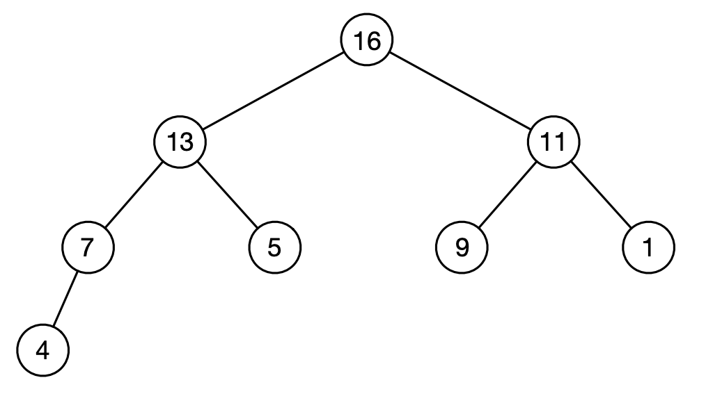

# Binary tree

A binary tree is a rooted tree. All levels in the tree are completely filled (each node has two children) except the last level which may not be completely filled. In the last layer, all keys are as left as possible.

Each node in a heap store v.key, v.parent, v.left, v.right

In a **max heap**, the root node must be the maximum among all keys. An example is given below. In a **min heap**, the root node must be the minimum among all keys.

## Operations in a binary heap

PARENT(x): return parent of x

LEFT(x): return left child of x

RIGHT(x): return right child of x

MAX(): return element with the largest key

EXTRACTMAX(): return and remove the element with the largest key

INCREASEKEY(x, k): set x.key = k (assume k>=x.key)

INSERT(x): insert key into heap at correct position

## Representation of a binary heap

Binary heap can be as an array H[0 ... n]. H[0] is unused. H[1 ... n] stores nodes in level order.

PARENT(x): return x/2

LEFT(x): return 2*x

RIGHT(x): return 2*x+1

For the image above, array H is: H = [-, 16, 13, 11, 7, 5, 9, 1, 4]

## Binary heap as a priority queue
insertKey(x), deleteKey(x), extractMax(), increaseKey(i,k) are operations in O(log(n)) time.