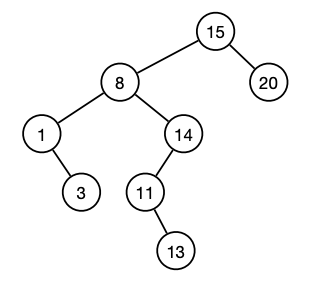

# Binary search tree

A binary search tree is a rooted tree, where each internal vertex has a left child and/or a right child. The tree must satisfy the search tree property:

Each vertex stores an element.

For each vertex v:

-all vertices in left subtree are <= v.key.

-all vertices in right subtree are >= v.key.

Given a dynamic set S. Each element x in S has s key x.key and satellite data x.data.

### Insertion
INSERT(x): add x to tree T. A new key is always inserted at the leaf. Start searching a key from the root until a leaf is reached, then add the new node as a child of the leaf node.

Start in root. At vertex v:

If x.key <= v.key: go left.

If x.key > v.key: go right.

If x.key = null: insert x.

PREDECESSOR(k): return element with largest key <= k.

SUCCESSOR(k): return element with smallet key >= k.

INSERT(x): add x to S (assume x is not already in S).

DELETE(x): remove x from S.

