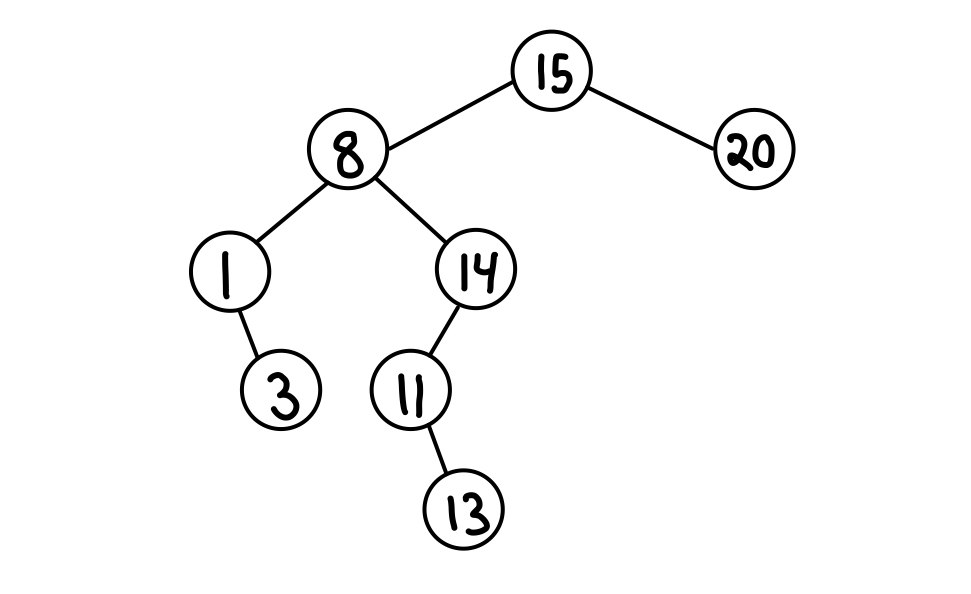
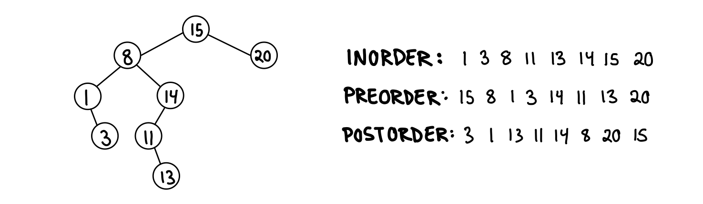

# Binary search tree

A binary search tree is a rooted tree, where each internal vertex has a left child and/or a right child. The tree must satisfy the search tree property:

Each vertex stores an element.

For each vertex v:

-all vertices in left subtree are <= v.key.

-all vertices in right subtree are >= v.key.

The left and right subtree is also a binary search tree. The proroperties provides an ordering among keys.

Given a dynamic set S. Each element x in S has s key x.key and satellite data x.data. 

## Insertion
INSERT(x): add x to tree T. A new key is always inserted at the leaf. Start searching a key from the root until a leaf is reached, then add the new node as a child of the leaf node.

Start in root. At vertex v:

If x.key <= v.key: go left.

If x.key > v.key: go right.

If x.key = null: insert x.

The time complexity of insertion is O(h), where h is the height of the tree.

## Predecessor and successor
PREDECESSOR(k): return element with largest key <= k.

SUCCESSOR(k): return element with smallet key >= k.

## Deletion

DELETE(x): remove x from S.

## Search

Search for x.key

Starting at the root:

1. If x.key is less than root, serach for x.key in the left subtree recursively. Else, search for x.key in the right subtree recursively.

2. If the element to search is found, return true. Else return false.

## Tree traversals

Inorder, preorder and postorder traversal traverses the binary search tree differently. As all of the methods visists all n vertices, the running time is O(n).

**Inorder traversal (LEFT, VERTEX, RIGHT)**

Visit left subtree recursively.

Visit vertex.

Visit right subtree recursively.

Inorder traversal prints out the vertices in a binary search tree in sorted order.

**Preorder traversal (VERTEX, LEFT, RIGHT)**

Visit vertex.

Visit left subtree recursively.

Visit right subtree recursively.

**Postorder traversal (LEFT, RIGHT, VERTEX)**

Visit left subtree recursively.

Visit right subtree recursively.

Visit vertex.

