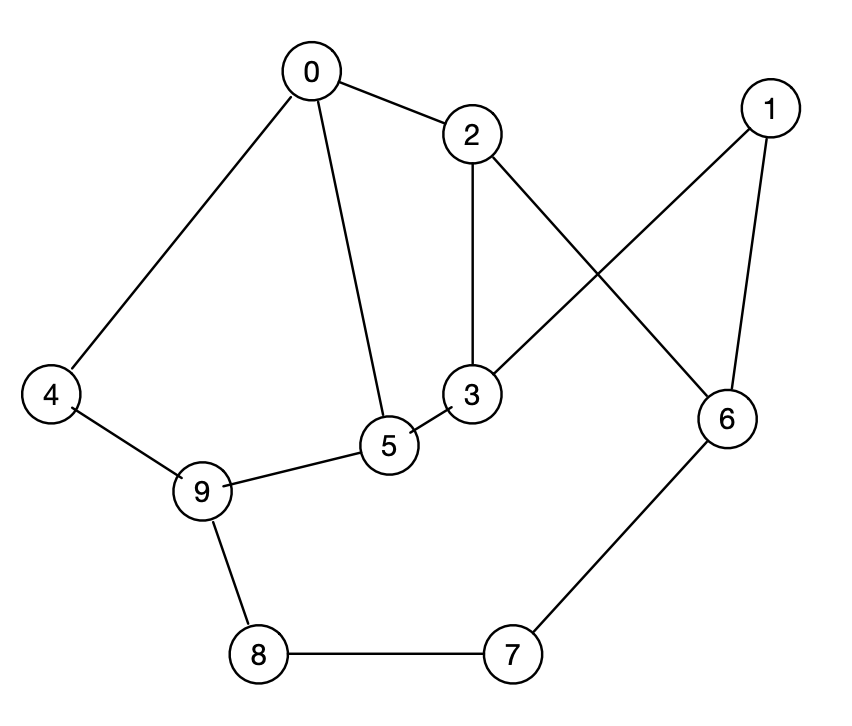
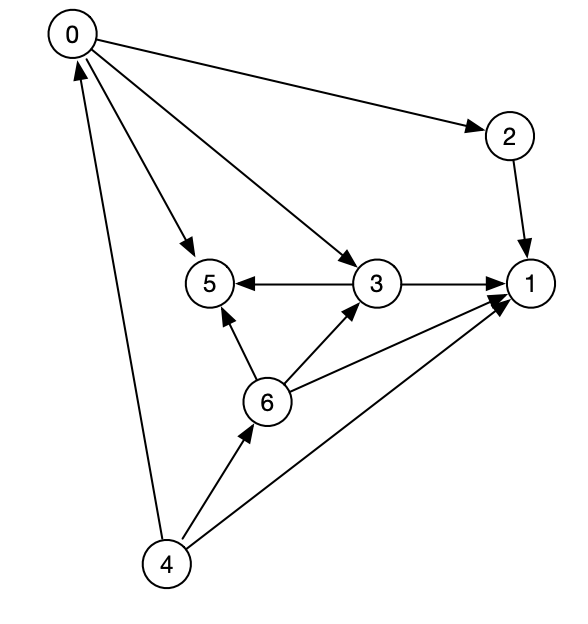
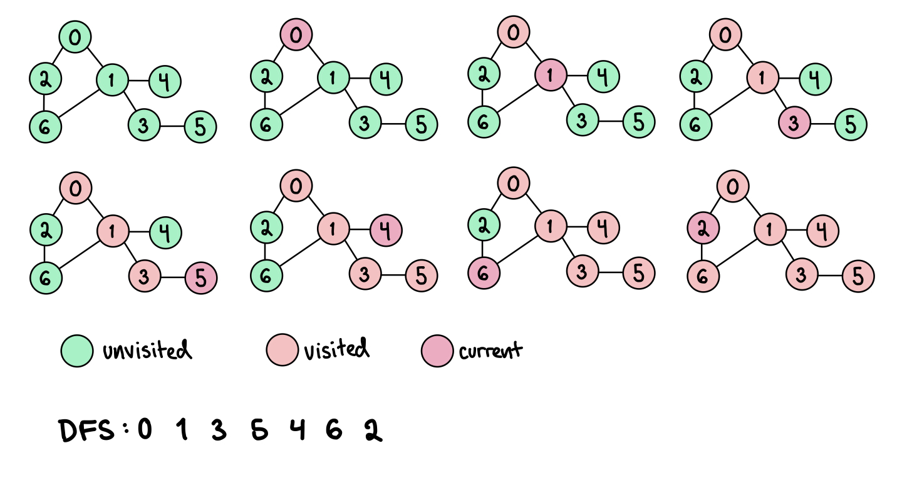
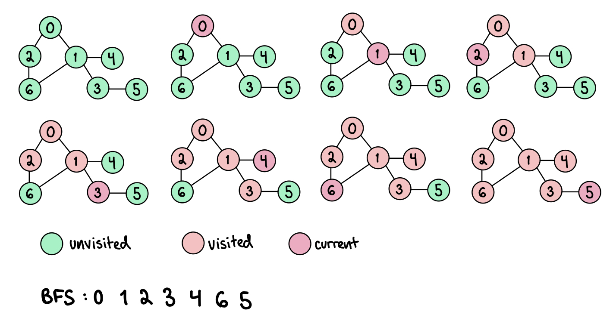
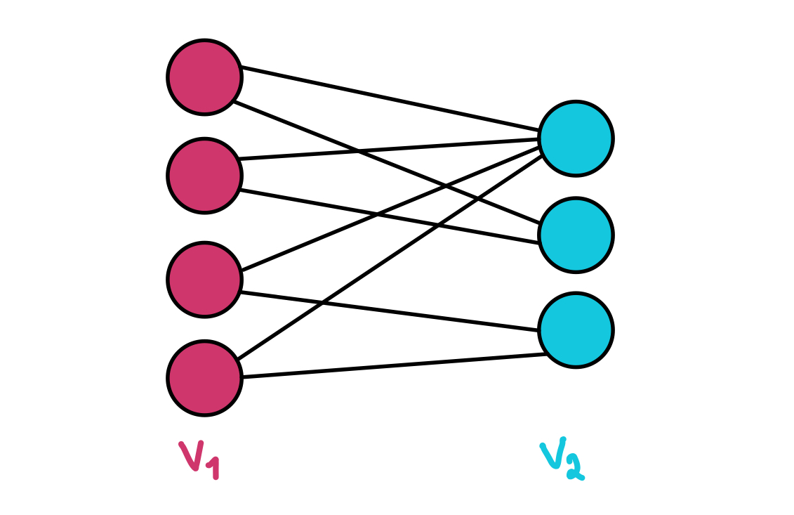
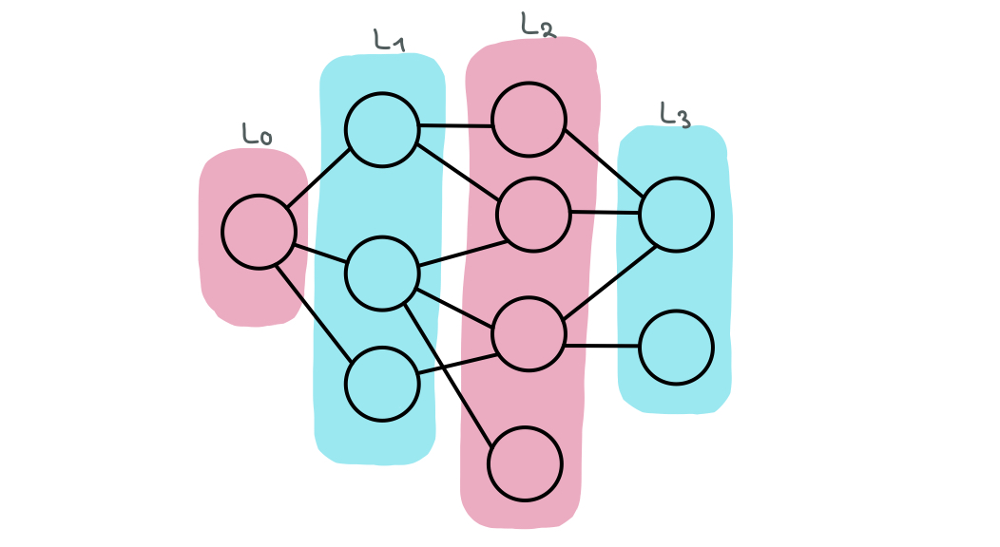

# Graph
V = set of verices.
E = set of edges. 
Each edge is connecting a pair of vertices.
Let N = number of vertices, and M = number of edges.
A graph is defined as a set of vertices V and a set of edges E. G = (V,E). 

A graph can be represented using adjacency matrix or adjacency list. 

## Adjacency matrix
The adjacency matrix is a 2D NxN array adj, where N is the number of vertices in a graph.
adj[i][j] = 1 if i and j are neighbors. adj[i][j] = 0 otherwise.
The adjacency matrix consumes O(N^2) space.

## Adjacency list
The adjacency list is an array of lists, A[0...n-1].
A[i] is a linked list of all neighbors of i.
The adjacency list consumes O(N+M) space. (n is number of vertices, m is the number of edges).

## Undirected graph
Set of vertices pairwise joind by edges.

## Directed graph
Set of vertices pairwise joined by directed edges.

## Path
Sequence of vertices connected by edges.

## Cycle
Path starting and ending at the same vertex.

DFS can be used to detect if there is a cycle in graph G. Visit all adjacent vertices of the current vertex. If adjacent vertex is already visisted and is not the parent of the current vertex, there is a cycle. An array must be made to maintain the parent vertex of each vertex.

## Depth-first search (DFS)
Systematically visits all vertices  in a graph. The nodes are visited "depth-wise".

Start at a root node. Visit adjacent vertex v. Mark v, and visit all unmarked neighbours of v recursively. Go back to previous vertex when all adjacent vertices are visited.

With adjacency list representation, the running time is O(N+M). All N nodes are visited. All neighbors of N are visited, in so all edges are traversed (M).

Space Complexity: O(N) (extra array to store visisted vertices is needed).
## Breadth-first search (BFS)
Systematically visits all vertices in a graph. BFS finds the shortest path from s to all other vertices. The vertices are visited "Breadth-wise".

The algorithm:

Each vertex in the graph is either visited or not visited.
1. Unmark all vertices and initialize queue Q.
2. Mark root node s as visited and add it to the queue (Q.ENQUEUE()).
3. While Q is not empty:
    v = Q.DEQUEUE()
    
    For each unmarked neighbour u of v: mark u and Q.ENQUEUE(u)

With adjacency list representation, the running time is O(N+M). All N nodes are visited. All neighbors of N are visisted, so all M edges must be traversed.

## Bipartite graph
A graph is bipartite if its vertices can be divided into two sets V1 and V2 such that all edges go between V1 and V2.

A graph G is bipartite if and only if all cycles in G have even length. Proof: if G is bipartite, all cycles must start and end on the same "side". Since there can be no edges between vertices on the same side, the edges must go  back and forth, which gives a cycle of even length.

To check is a graph is bipartite, run BFS on G. For each edge in G, check if its endpoints are in the same layer. If the end points are in different layers, the graph is bipartite. Running time: O(N+M) (BFS running time).

