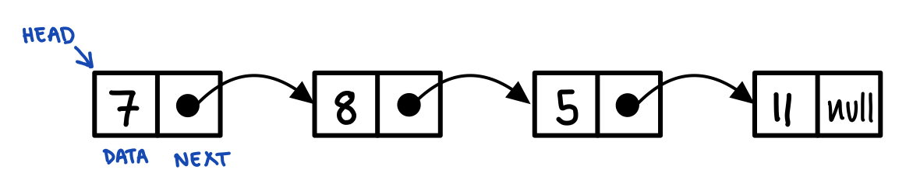
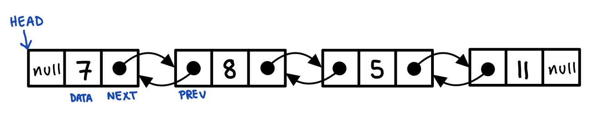

# Linked List Data Structure

Linked list is a linear data structure, maintaing a dynamic sequence of elements. The elements are linked using pointers. 

A singly linked list can be illustrated as:

A doubly linked list can be illustrated as:

A linked list consists of nodes where each node contains a data field and a reference to the next node in the list. For doubly linked list, the node also contains a reference to the previous node in the list.

Linked list give fast insertion and deletion.

