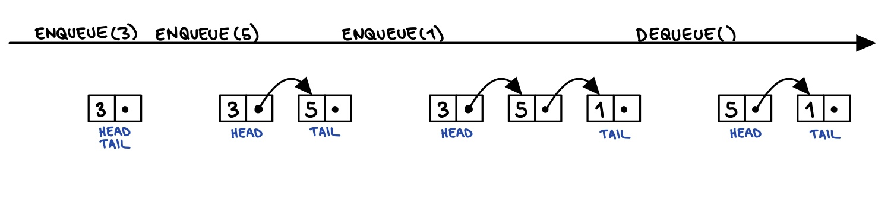

# Queue

Queue is a linear structure, maintaining a dynamic sequence Q supporting the following operations:

ENQUEUE(x): add x to Q.

DEQUEUE(): remove and return the first added element in Q.

ISEMPTY(): return true if Q is empty.

Queue is a "First In First Out" (FIFO) data structure, where a new element is added at the back, and the elements are removed from the top.

ENQUEUE(x) should check for overflow condition (possibility to add another element) and DEQUEUE should check for underflow condition (possibility to remove another element).

## Implementation using Array

Maintain array Q[0 ... N-1]. Keep track of head index, tail index and a counter. Counter keeps track of the number of elements in the queue.

ENQUEUE(x): add x at S[tail], update count and tail cyclically.

DEQUEUE(): return Q[head], update count and head cyclically.

ISEMPTY: return true if count = 0.

Each operation is O(1) time.

Space: O(N).

Disadvantage: capacity must be known. Also, initializing an array of size N might be waste of space.

## Implementation using Linked List
Keep track of head and tail node. 

ENQUEUE(x): if it is the first node, make the head and tail this node. Else, make the current tail point to the new node. Make the new node the tail.

DEQUEUE(): Return head.data. Make the head the node head is pointing to. 

ISEMPTY(): return true if head == NULL.

