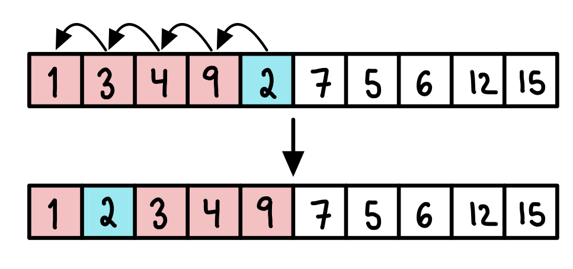
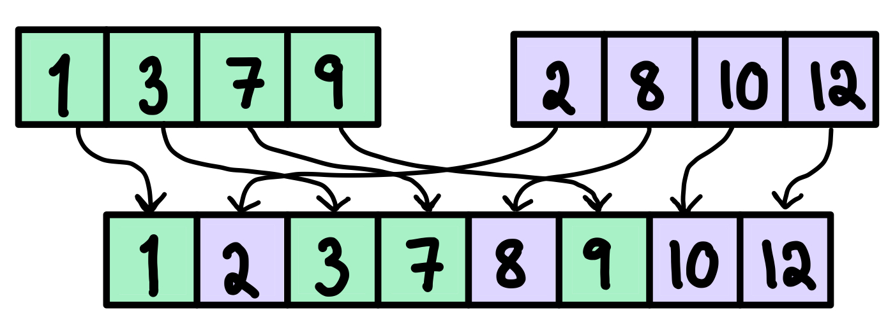
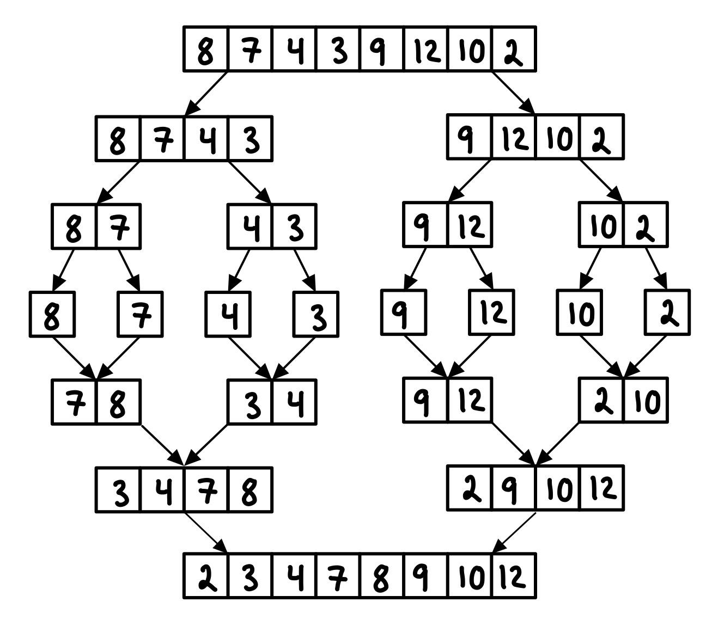

# Sorting

Given an array A[0 ... n-1], return an array with same values as A but in sorted order.

## Insertion Sort
Insertion sort is an intuitive way of sorting an array, and is similar to how you would sort a deck of cards.

Iterate from A[0] to A[n-1]. Compare the current element to its predecessor. If the element is smaller than its predecessor, compare it to the elements before. Insert the element at the correct position, and move all the greater elements one position back.

At round i, subarray A[0 ... i-1] is sorted. Insert A[i] into A[0 ... i-1] to make A[0 ... i] sorted.

Time complexity: O(n^2)

## Merge Sort
The core of merge sort is to *merge* two sorted arrays into a single sorted array. Starting from the left of both arrays, insert the smallest of the two entries in the new array. Repeat until all elements in both arrays are inserted into the new array.

Merge Sort is a **Divide and Conquer** algorithm, it divides the input into two halves, sort each half recursively, and then merges the two sorted halves.

The array is recursively divided into halves until the sizes becomes 1. Then, the arrays are merged back until the complete array is merged.

For an array A[0 ... n-1], the algorithm has to make log2(n) recursive calls. The sorting of sorted subarrays in each call takes n time. This gives time complexity O(n log(n)).