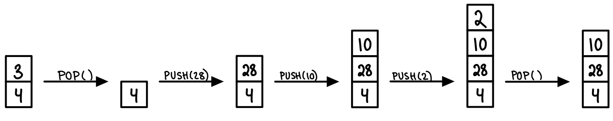

# Stack

Stack is a linear data strcture, maintaing a dynamic sequence S supporing the operations:

PUSH(x): add x to S

POP(): remove and return the most recently added element in S

ISEMPTY(): return true if S is empty

All of the operations take O(1) time.

Stack is a "First In Last Out" (FILO) datastructure, where a new element is added at the top, and the element are removed from the top.

PUSH and POP should check for overflow and underflow condition (making sure array doesn't exceed its capacity in PUSH, and doesn't pop any element if array is empty).

## Implementation using Array

Maintain array S[0 ... N-1]. Keep track of the top index (top). Initially top = -1.

PUSH(x): add x at S[top+1], top = top+1

POP(): return S[top], top = top-1

ISEMPTY(): return true if top=-1

Running time: O(1) (for each operation)

Space: O(N)

## Implementation using Singly Linked List

Keep track of tope node. Initially top = nullptr.

PUSH(x): initialize node N. Make N the top node, and make N point to the previously top node.

POP(): return data of top node, and making the second node to be the top node.

ISEMPTY(): return true if top = nullptr.

