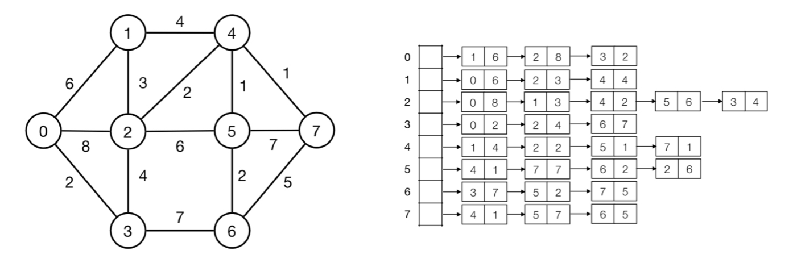

# Weighted graph
Similar implementation as a regular graph, but each edge e has a weight w(e).

A weighted graph can be represented by an adjacency list, where both neighbour and weight is stored. In this implementation, this will be used by an vector of pairs of integers. An example of a weighted graph with associated adjacency list is given below.

## Spanning tree
Subgraph T of graph G over all vertices that is connected and acyclic.

## Minimum spanning tree (MST)
Spanning tree of minimum total weight.

## Kruskal's algorithm
TODO

## Prim's algorithm
Used to find a minimum spanning tree.

**Idea:** Grow a tree T from vertex s. In each step, add *lightest* edge with one endpoint in T. Stop when T has n-1 edges.

**Implementation:** using priority queue. Maintain vertices outside T in a priority queue. The key of vertex v is the weight of lightest cut edge (infinity if no cut edge). In each step, find lightest edge with EXTRACT-MIN. Update weight of neighbors of new vertex with DECREASE-KEY.

## Dijkstra's algorithm
TODO
